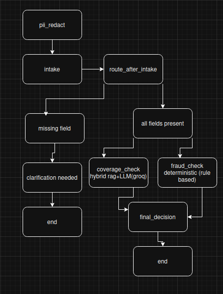
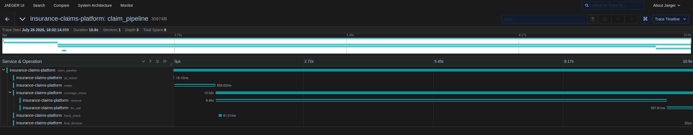
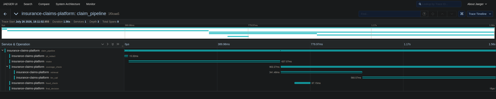

# Meridian

**A multi-agent insurance claims platform** — LangGraph orchestration, hybrid RAG retrieval, deterministic guardrails, distributed tracing, JWT-authenticated API and rate limiter.

Meredian ingests a raw claim, redacts PII, extracts structured fields, retrieves the relevant policy clauses, runs a coverage decision and a fraud check in parallel, and returns a final, auditable decision — all traceable end to end.

<!-- DEMO VIDEO -->
## Demo

[**Watch the walkthrough, click here!**](https://youtu.be/rTK51WJ_USU?si=78soOjZFDW5LhjMd)


---

## Architecture

<!-- ARCHITECTURE DIAGRAM -->


```

```

- **`pii_redact`** strips PII (Presidio) before any LLM ever sees the claim text.
- **`intake`** extracts structured fields (Groq / Llama 3.3 70B, forced into a Pydantic schema).
- **`coverage_check`** and **`fraud_check`** run **in parallel** — independent questions ("is this covered" vs. "is this claim trustworthy"), no reason to serialize them.
- **`fraud_check` is pure Python, not an LLM call.** It started as an LLM+RAG check and was rebuilt as deterministic rule logic after repeated false positives/negatives revealed the underlying signal (a policy-number prefix rule) was a closed-form fact, not a judgment call — full story in `DECISIONS.md` §Phase 3.
- **`final_decision`** merges both results and overrides a decision to `needs_review` only if fraud was flagged *and* the claim was otherwise approved — a denial is already the conservative outcome and isn't re-routed.

---

## Features

- **LangGraph orchestration** — sequential + parallel (fan-out/fan-in) agent workflow with conditional routing
- **Hybrid retrieval** — vector search (Chroma) + BM25 keyword search + cross-encoder reranking, benchmarked against each method in isolation
- **PII redaction** — Presidio, with a domain-specific false-positive guard so policy numbers never get mistaken for names
- **Deterministic fraud rules** — no LLM in the loop for facts that don't require judgment
- **Distributed tracing** — OpenTelemetry + Jaeger, including manual cross-thread context propagation for the parallel branch
- **Full audit trail** — every claim decision persisted to MySQL: inputs, retrieved context, decisions, latency, and per-claim token cost
- **JWT authentication** — bcrypt password hashing, per-user claim scoping, rate-limited login
- **React frontend** — login, claim submission, decision view, and claim history

---

## Screenshots

<!-- JAEGER TRACE -->
### Distributed trace (Jaeger)



*This trace is what led to diagnosing a 9.46s bottleneck inside retrieval — traced to Hugging Face's per-load model-update check firing on every process start — fixed with `HF_HUB_OFFLINE=1`, cutting total latency from 10.9s to 1.56s.*

<!-- Optional: add app screenshots here too -->
<!--  -->
<!--  -->

---

## Results

| Metric | Result |
|---|---|
| Retrieval recall@3 (hybrid + rerank) | **1.000** across a 25-query labeled eval set |
| Retrieval MRR | 0.980 |
| Per-claim latency | **10.9s → 1.56s** (~85% reduction) after diagnosing an unnecessary network call via tracing |
| Per-claim cost | ~$0.00058 (Llama 3.3 70B via Groq) |
| Fraud rule tests | 13/13 passing, including the exact multi-violation case hit in production |
| Auth | Verified user-scoped claim isolation across separate accounts; rate limiting confirmed to trigger under brute-force |

Full methodology and limitations for the retrieval evaluation: [`eval/RESULTS.md`](./eval/RESULTS.md).

---

## Tech Stack

| Layer | Tools |
|---|---|
| Orchestration | LangGraph, LangChain |
| LLM | Groq (Llama 3.3 70B Versatile) |
| Retrieval | ChromaDB, rank_bm25, sentence-transformers (cross-encoder) |
| Guardrails | Microsoft Presidio |
| Observability | OpenTelemetry, Jaeger |
| Backend | FastAPI, PyJWT, bcrypt, slowapi |
| Database | MySQL (PyMySQL) |
| Testing | pytest |
| Frontend | React (Vite) |

---

## Getting Started

### Prerequisites
- Python 3.12+
- Node.js (for the frontend)
- MySQL running locally
- Docker (for Jaeger)
- A [Groq API key](https://console.groq.com)

### Backend

```bash
pip install -r requirements.txt
cp .env.example .env   # fill in GROQ_API_KEY, DB_*, JWT_SECRET

mysql -u your_user -p < db/schema.sql
mysql -u your_user -p < db/auth_schema.sql

docker run -d --name jaeger \
  -p 16686:16686 -p 4317:4317 -p 4318:4318 \
  jaegertracing/all-in-one:latest

uvicorn app.api:app --reload
```

API docs available at `http://localhost:8000/docs`. Jaeger UI at `http://localhost:16686`.

### CLI (no server needed)

```bash
python -m app.main "Basement flooded during heavy rain on 2026-05-02, policy H-77102, requesting $8,000 for damage."
```

### Frontend

```bash
cd frontend
npm install
npm run dev
```

### Tests

```bash
pip install pytest
python -m pytest tests/ -v
```

### Retrieval evaluation

```bash
python -m eval.run_eval
```

---

## Project Structure

```
meredian/
├── app/
│   ├── state.py            # Shared graph state schema
│   ├── models.py            # Pydantic schemas (ExtractedClaim, CoverageDecision, FraudCheck)
│   ├── llm.py                # Groq client wrapper
│   ├── pii.py                 # PII redaction
│   ├── fraud_rules.py         # Deterministic fraud checks
│   ├── token_usage.py         # Token/cost tracking
│   ├── tracing.py             # OpenTelemetry setup
│   ├── nodes.py               # LangGraph node functions
│   ├── graph.py                # Graph construction
│   ├── main.py                  # CLI entry point
│   ├── audit_store.py           # MySQL audit persistence
│   ├── auth.py                   # JWT + password hashing
│   ├── api.py                     # FastAPI app
│   └── retrieval/                  # Vector store, keyword store, hybrid search
├── data/                             # Policy document corpus, sample claims
├── db/                                # SQL schema files
├── eval/                               # Retrieval evaluation harness + results
├── tests/                               # Unit tests
├── frontend/                             # React app
├── DECISIONS.md                           # Why, not just what — the engineering log
└── README.md
```

---

## Notes

A few of the more interesting problems solved along the way :

- **A race condition** in the retrieval layer, surfaced only once nodes started running in parallel — fixed by building shared resources once at import time instead of lazily.
- **A fraud-detection redesign** — an LLM-based check was replaced with deterministic code after repeated prompt-tuning failed to fix both a false positive and a false negative, revealing the underlying question was never actually a judgment call.
- **An 85% latency reduction**, diagnosed (not guessed) via distributed tracing down to a single unnecessary network round-trip.
- **A live PII false positive**, caught through the actual UI, root-caused, and fixed with a targeted regex guard rather than a blunt confidence-threshold change.

---
